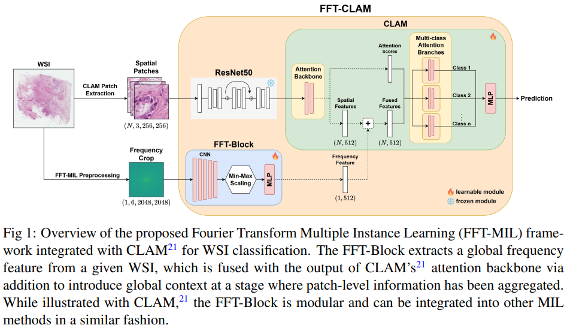
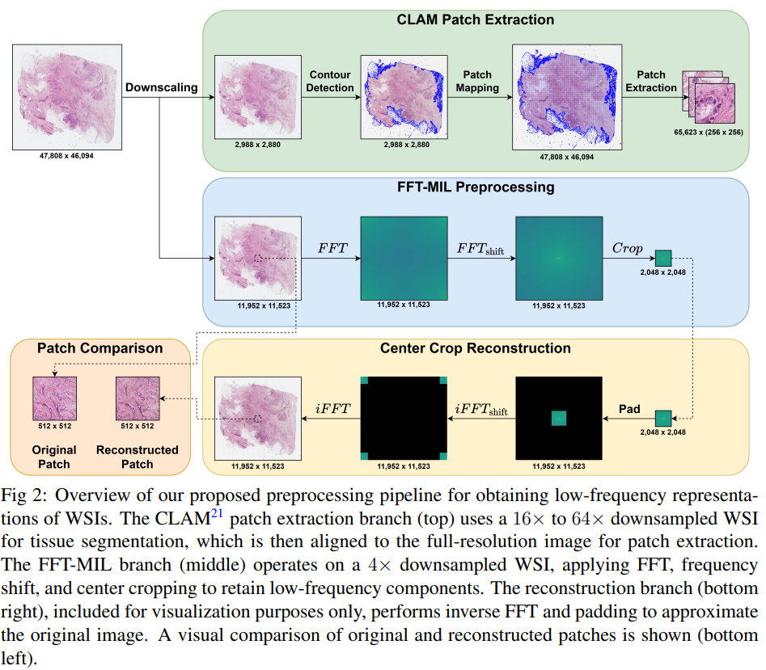
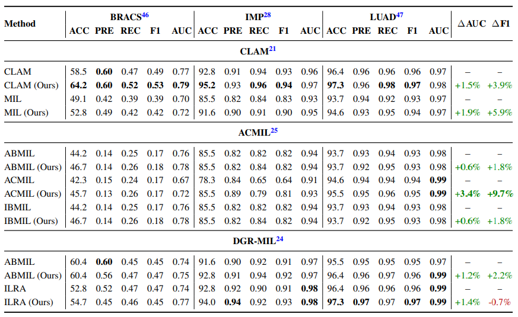

# FFT-MIL: Fourier Transform Multiple Instance Learning for Whole Slide Image Classification

## Summary
We propose Fourier Transform Multiple Instance Learning (FFT-MIL), a framework that augments MIL for WSI classification with a frequency-domain branch to provide compact global context. Low-frequency crops are extracted fromWSIs via the Fast Fourier Transform and processed through a modular FFT-Block composed of convolutional layers and Min-Max normalization to mitigate the high variance of frequency data. The learned global frequency feature is fused with spatial patch features through lightweight integration strategies, enabling compatibility with a diverse set MIL of architectures.

## Architecture


## Preprocessing


## Setup Overview
1. Install requirements  
2. Create data directories 
3. Download datasets  
4. Preprocess images and Setup ACMIL split
5. Create frequency representations
6. Replicate results
7. Paper results
8. Future directions
---

### 1. Install requirements
```bash
conda create -n fftmil python=3.9
conda activate fftmil
pip install -r requirements.txt
```
---

### 2. Create data directories
```bash
python FFT-MIL/dataset_setup/setup_data_dirs.py
```
<details>
  <summary>Expected file structure</summary>

```text
/data/fftmil/
├── BRACS/
│   └── images/
├── LUAD/
│   └── images/
└── IMP/
    └── images/
```
</details>

### 3. Download datasets (Ubuntu 22.04)
*Note: `FFT-MIL` refers to the path of the top-level of this repository.*

#### A. [BRACS](https://www.bracs.icar.cnr.it/download/)
```bash
cd /data/fftmil/BRACS/
wget --no-parent -r ftp://histoimage.na.icar.cnr.it/
python FFT-MIL/dataset_setup/move_bracs_images.py
```
#### B. [LUAD](https://www.cancerimagingarchive.net/collection/cptac-luad/)
Manually download the **Histopathology** data to:  `/data/fftmil/LUAD/` 
```bash
python FFT-MIL/dataset_setup/move_luad_images.py
```
#### C. [IMP](https://rdm.inesctec.pt/dataset/nis-2023-008)
```bash
python FFT-MIL/dataset_setup/download_IMP.py
```
---

### 4. Preprocess images and Setup ACMIL split
#### A. Create patches
```bash
cd FFT-MIL/CLAM/
python create_patches_fp_bracs.py
python create_patches_fp_luad.py
python create_patches_fp_imp.py
```
#### B. Create features
```bash
cd FFT-MIL/CLAM/
python extract_features_fp_bracs.py
python extract_features_fp_imp.py
python extract_features_fp_luad.py
```
#### C. Setup ACMIL Split
```bash
cd FFT-MIL/ACMIL/
create_datasets_h5.py
```
#### D. Test preprocessing was successful
```bash
cd FFT-MIL/CLAM/
create_datasets_h5.py
```

### 5. Create frequency representations
*Note: You can run multiple instances of each these files in parallel to speed up the process.*
```bash
cd FFT-MIL/create_ffts/
create_bracs_fft.py
create_imp_fft.py
create_luad_fft.py
```


### 6. Replicate results
*Note: Run each file from their **DIRECTORY**, where the `<DATASET>` corresponds to the dataset on which you wish to run the experiment.*

| Method       | DIRECTORY  | FILE |
|--------------|-------|-----------|
| CLAM         | CLAM | `train_clam_<DATASET>.py`     |
| CLAM (Ours)  | CLAM | `train_clam_<DATASET>_fft.py`     |
| MIL          | CLAM | `train_mil_<DATASET>.py`     |
| MIL (Ours)   | CLAM | `train_mil_<DATASET>_fft.py`     |

| Method       | DIRECTORY  | FILE |
|--------------|-------|-----------|
| ABMIL        | ACMIL | `train_abmil_<DATASET>.py`     |
| ABMIL (Ours) | ACMIL | `train_abmil_<DATASET>_fft.py`     |
| ACMIL        | ACMIL | `train_acmil_<DATASET>.py`     |
| ACMIL (Ours) | ACMIL | `train_acmil_<DATASET>_fft.py`     |
| IBMIL        | ACMIL | `train_ibmil_<DATASET>.py`     |
| IBMIL (Ours) | ACMIL | `train_ibmil_<DATASET>_fft.py`     |

| Method       | DIRECTORY  | FILE |
|--------------|-------|-----------|
| ABMIL        | DGR | `train_abmil_<DATASET>.py`     |
| ABMIL (Ours) | DGR | `train_abmil_<DATASET>_fft.py`     |
| ILRA         | DGR | `train_ilra_<DATASET>.py`     |
| ILRA (Ours)  | DGR | `train_ilra_<DATASET>_fft.py`     |

For example, to run the CLAM method on the BRACS dataset, you would run:
```bash
cd FFT-MIL/CLAM/
python train_clam_BRACS.py
```



## References
This repository incorporates code from the following papers.
- [Data Efficient and Weakly Supervised Computational Pathology on Whole Slide Images (CLAM)](https://github.com/mahmoodlab/CLAM)
- [Attention-Challenging Multiple Instance Learning for Whole Slide Image Classification (ACMIL)](https://github.com/dazhangyu123/ACMIL)
- [Exploring Diverse Global Representation in Multiple Instance Learning for Whole Slide Image Classification (DGR-MIL)](https://github.com/ChongQingNoSubway/DGR-MIL)